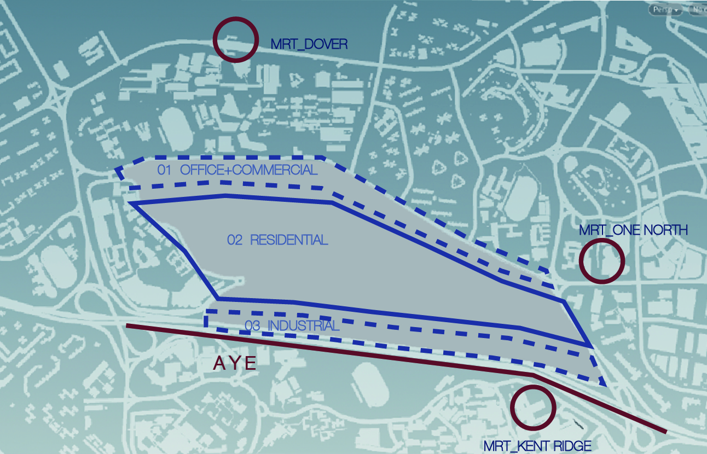

# Iteration 1

2.19.2.1 Site Division

-Zone Division
In order to create a self-sustaining ecosystem, generating a mixture of blocks for the residential, industrial, office and commercial function. The first iteration divided the site into three distinct zones according to the influence of AYE and MRT around it. The office-commercial mixed zone located on the north of the site as a buffer zone, it can both accessible for people live in site and out of site, to help people here have more opportunity to contact with others. The residential zone is in the core of the site, so that it will be easy to reach both other functions and MRT stations. The industrial zone acts as a buffer zone in order to decrease the noise from AYE. Each zone was then designed with a separate set of attributes and conditions to present different environment in response to their method of use.

-Road Division
Network structure is divided by the suitable scale, also the relationship with MRT stations and surrounded main roads. It also referred to the relationship between three clusters for the closer touch. I did not intend to act it in a fancy way at first in order to make sure the good connection and accessibility. 

2.19.2.2Propose Building Typology
-Zone 01: Office-commercial mixed zone
 
The typology of this zone was podium and tower. It mainly present along Dover, at the nouth of the site. This office here (showing in yellow) is to set up an area for residents who are able to work close to their homes. And offices are also placed together with the commercial area (showing in blue) to make grabbing food and beverage easily for officers and residents. Due to the amount of buildings on site, the commercial part is 4 floors in average while the office part is 12 floors in average.

-Zone 02: Residential Zone
 
The typology of this zone was arranged in a courtyard configuration.Residential blocks are placed sandwiched the other two zones, the height was influenced by both MRT stations and AYE. It was developed by dividing the big blocks into a 105*105 meter grid which is walkable. It both close to the office zone, and easy to reach MRT stations present near the site. Every blocks was divided into four parts, surrounded with a green courtyard. So it can contents good view and ventilate. Small gaps between buidings make it more reachable. Due to the amount of residential blocks on site, this producing mid rise blocks with an average of 9 floors.

-Zone 03: Industrial Zone
 
The industrial block forms with a single volume, with a courtyard green space in front. This is for the loading of heavy equipment as well as to separate from residential area. Providing a leisure area for workers. Due to the amount of industrail blocks on site, the buildings are 18 floors in average.
 
2.19.2.3 Initial settings
Residential: 22sqm per person
Commercial: 5 sqm per person
Industrial: 3 sqm per person
Office: 5 sqm per person
Residential storey height: 3m
Office storey height:4m
Commercial storey height: 5m
Industrial storey height:4m
First Level Roads 8m
Second Level Roads 5m
Pedestrian roads 3m

2.19.2.4 Evaluation Analysis  

 
Good Building
 
View Factor
 
Daylight Factor
 
Solar Factor
Good Building Ratio: 50 %
2.19.2.5 Conclusion: 
The results were showing that half of the buildings were good buildings. After going through the evaluation nodes I realized it was mainly because of the view factor and solar factor. Most of the bad buildings situated in the middle of residential blocks, also many parts of office-commercial zone and a small part of industrial zone. According to the ratio, the bad buildings in residential area are bad at day light factor and view factor, this may because the blocks are crowded. The bad buildings in office-commercial area are bad at solar factor.
