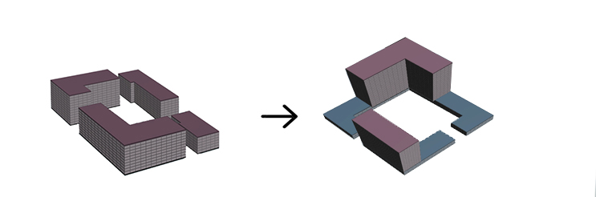
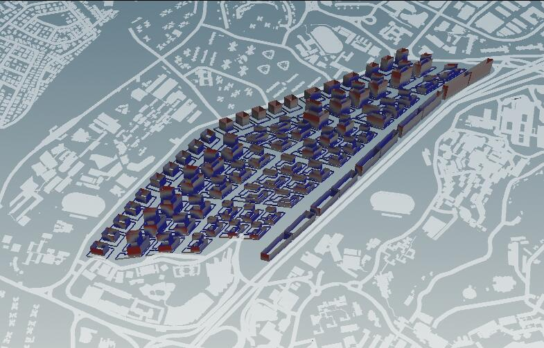
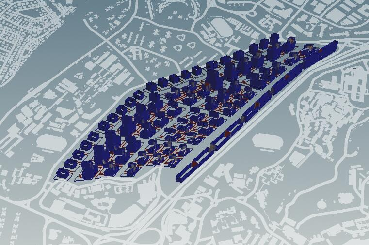

# Iteration 2

The second iteration is a continuation of the first one, according to the evaluation in literation 1. I tried to still remain the three core zones and deal with the problems in several ways in different zones.
 
Urban morphology settings Changes
Commercial: 6 sqm per person
Industrial: 3 sqm per person
Office: 4 sqm per person
First Level Roads 9m
Second Level Roads 6m
Zone 01
1.	Recreate the scale 

According to last literation, bad buildings in this part had bad solar factor and daylight factor. This may because of the big scale of the building and small gaps between them. So I tried to change it into smaller scales, gaining more free spaces and taller buildings.

Zone 02
 
1.	Reset the function of residential zone.
2.	Increase the area of green land.
In this literation, residential-commercial mixed blocks were used instead of the single function zone. The commercial area was considered as the podium  while the residential area was the tower. The appearance of commercial areas (showing in blue) can be convenient for residents to grab food, buy daily supplies, etc. At the same time, the decrease of residential area (showing in pink) will lead to much taller buildings. This can affect view factor and solar factor which some of the buildings in this zone are bad at. 
What’s more green areas started to appear at the core zone of each blocks, this made the whole idea more reasonable.

Zone 03
1.	Change the gap between two buildings
Since there is only one bad building in this zone, I remained the original form of it. Adjusted the boundary, the gaps between two buildings and the extrude distance between podium and tower.
The overview of this literation is showing below.
 
 
Evaluation Analysis  
 
Good Building
  
Solar Factor
  
Daylight Factor
   
View Factor
   
Passive Ratio
    
Good Window 

Conclusion:
The evaluation results were significantly improved compared with Iteration1 by making the buildings taller, the recreation of some of the building typologies, rearrangement of the functions. All the residential and industrial buildings turned to be good buildings. Nevertheless, there is still buildings need to be improved. Especially the podium of office and residential buildings. According to the evaluation, view factor did not perform well in these buildings. Mainly due to the hiding of surrounding tall buildings and the few floors, so it is necessary to decrease the hiding areas. Daylight factor got the best result in this literation. Since the form of bad buildings are focused. The main concentration of next literation has a clear direction and a defined goal. 

