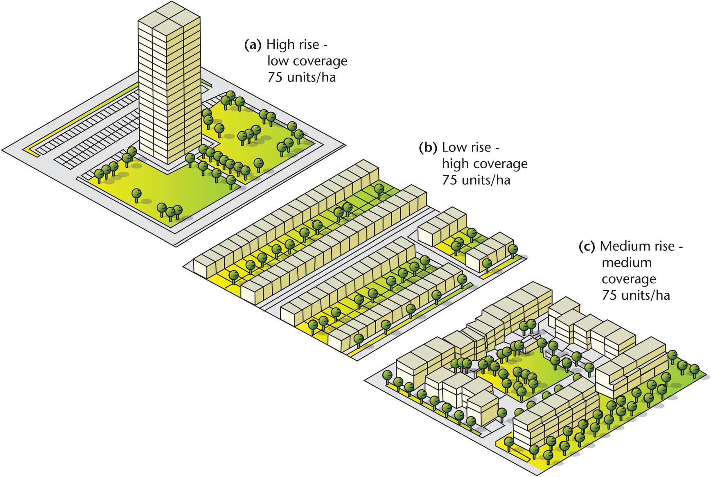

# Introduction - Overall Design Goals 

This chapter is an exploration of urban prototyping where urban ventilation starts off as a driver for the initial morphology of the urban block, followed by other considerations.

The programs within this urban prototyping master plan include residential, institutional (clean-tech R&D, offices), and commercial. 

Figure 0.1 Plot coverage and Building Typology

### Urban ventilation 

The starting point for the generation of urban prototype was the aim of having a good urban wind environment that facilitates ventilation on this neighbourhood/district scale. Adequate urban wind design is relevant because the urban aerodynamic property affects natural ventilation and air quality, affecting thermal comfort. 
This is achieved by avoiding closely packed high-rise buildings that often result in stagnant air in high-density urban areas, choosing a medium coverage typology that mixes high-rise and low-rise buildings rather than a medium-rise high site coverage design.

__Widening the Street Canyon__

The main purpose of having wider street canyons is to allow for air flow and turbulent mixing at the urban canyon layer, both of which are essential for improving urban air ventilation, for alleviating air pollution and for dissipating the anthropogenic heat.

While wide, open canyons (low H:W ratios) experience higher daytime temperatures due to high solar exposure, as compared to deep, narrow canyons (high H:W ratios) where buildings self-shade the canyon, direct solar radiation exposure can easily be mitigated for better thermal comfort on streets through planting of trees, along the roads, left to the discretion of specification of landscape architects and urban designers. 

Figure 0.2 Street Canyon

__Introducing an Air Path, and Orientation of Streets__

A strip of land with low frontal area density, corresponding to Class 1 wind velocity ratio classification (good pedestrian-level natural ventilation), that can serve as a green link/open area for recreation. 
As a rule of thumb, breezeways should be aligned in parallel, or up to 30 degrees to the prevailing wind direction, in order to maximise penetration of prevailing winds. As such, apart from the designated air path, the array of main streets, have been oriented along the NNE direction. 

Figure 0.3 Annual wind rose (m/s) (1981-2010) Singapore

### Design Goals

The other considerations that influenced the overall design goals are as follows: 
* The potential for integrating public space and recreation space within each urban block, achieved through designing for sufficient open spaces. 
* Urban permeability to facilitate connectivity
* Amenities within 400m pedestrian catchment if possible, to facilitate walkability 
* Broad overview of zoning. 
  * Residential buildings, tower block -  Increase relative density with closer proximity to MRT stations, reduced density along AYE because of traffic noise
  * Institution buildings, podium block- Increase relative density with closer proximity to Utown, and AYE (since those buildings are more likely to be air-conditioned and closed off, where noise will be less of a concern), allowing a buffer distance between residential blocks and AYE. 
  * Commercial, precinct blocks providing each urban block with a sense of enclosure for the public space that resides within it. 

### Evaluation of Building Performance

* Good window thresholds
  * View factor > 0.4
   * Daylight factor > 0.1
  * Solar factor < 0.2
* Good building thresholds
  * Passive area ratio > 0.5
  * Good window threshold > 0.1

