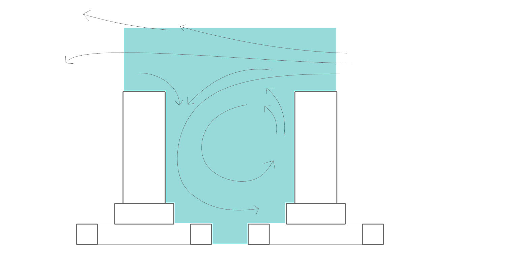
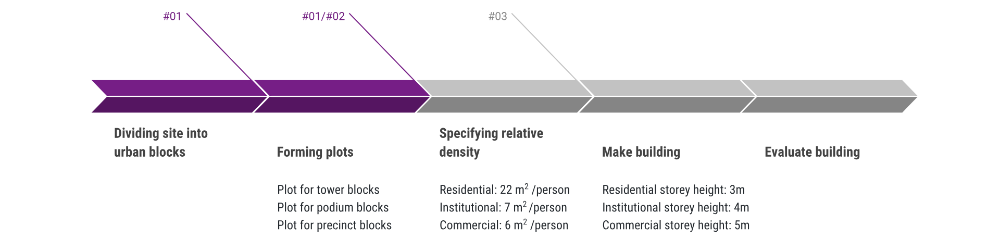
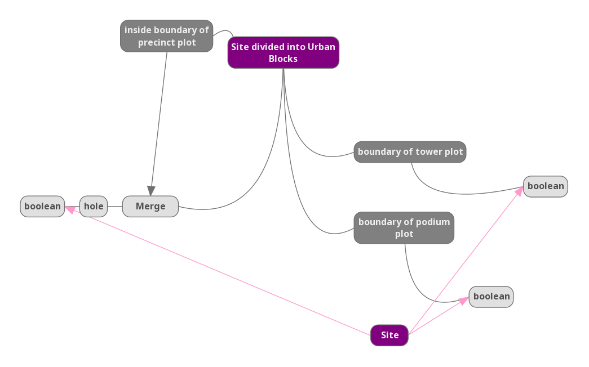
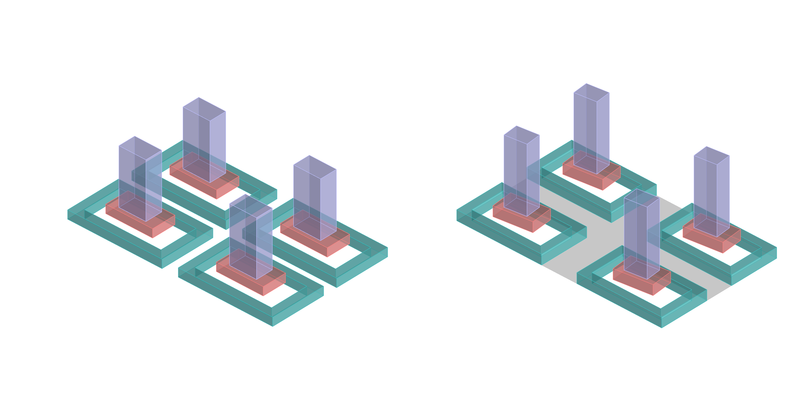

# Iteration 1 - Morphology of Urban Block

Figure 1.0 Iteration 1

For the first iteration, the different “tiers” of the urban block are generated in order to form the podium + tower typology.

Figure 1.1 Community and recreation space within atrium and podium blockprocess for iteration 2

### Generative Process

This is generated through the following process:

Dividing site into urban blocks > Forming plots > Specifying relative density for each required program > Make building > Evaluate building

Figure 1.2 Generative process for iteration 1

Figure 1.3 Computational process for iteration 1

### Parameters

* Residential storey height: 3m
* Commercial storey height: 5m
* Institutional storey height: 4m
* Road width: 8m

### Changes to Iteration 

* increasing the street width (thereby improving the view factor and daylight factor)
     * changed polyexpand setting: offset (inside) from 4m to 6m
* rotating building angle to better align with east-west orientation, for better daylight
     * done by editing scale of primitive of both the podium plots: x:0.6, y:0.4, z:1
      

Figure 1.4 Widening street width and Rotating building angle

(do note that diagrams are only a graphical representation and not accurate to scale)

Figure 1.5 Iteration 1 and iteration 1b

### Evaluation of Results

Lorem ipsum dolor sit amet, consectetur adipiscing elit, sed do eiusmod tempor incididunt ut labore et dolore magna aliqua. Ut enim ad minim veniam, quis nostrud exercitation ullamco laboris nisi ut aliquip ex ea commodo consequat. Duis aute irure dolor in reprehenderit in voluptate velit esse cillum dolore eu fugiat nulla pariatur. Excepteur sint occaecat cupidatat non proident, sunt in culpa qui officia deserunt mollit anim id est laborum.
