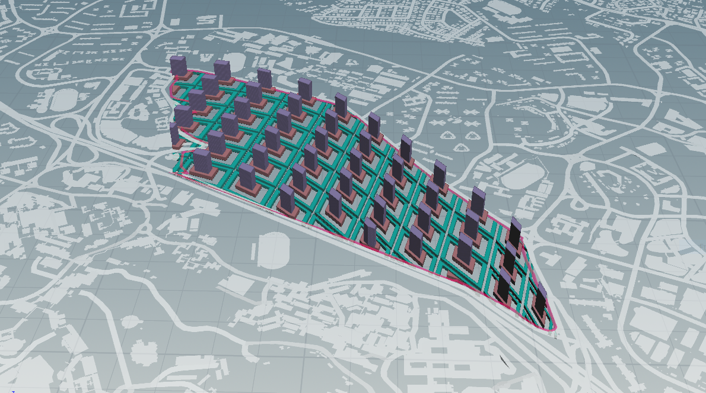
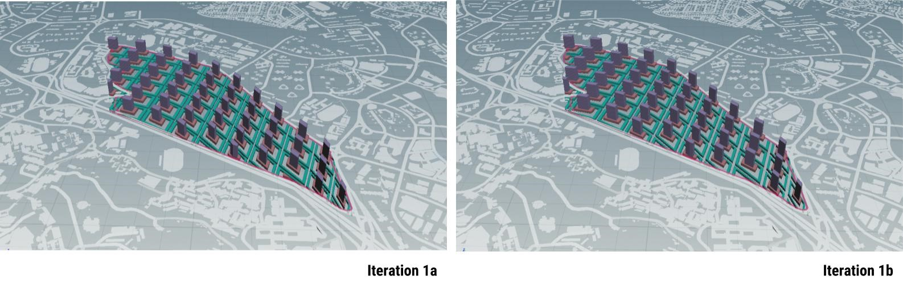
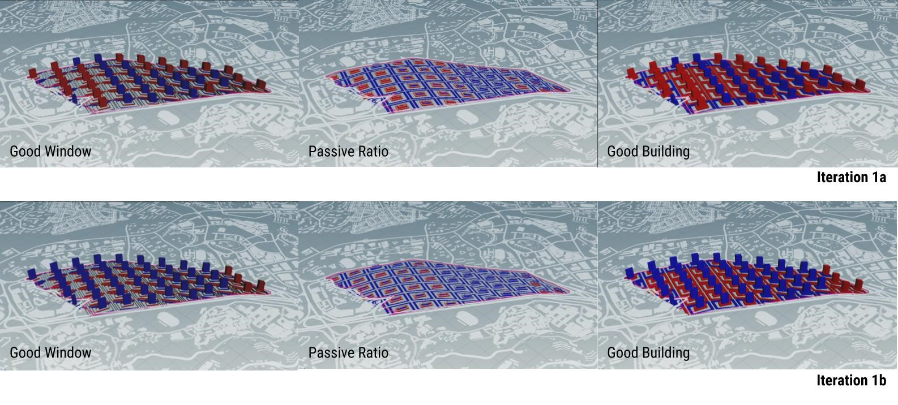

# Iteration 1 - Morphology of Urban Block

Figure 1.0 Iteration 1

For the first iteration, the different “tiers” of the urban block are generated in order to form the podium + tower typology.

Figure 1.1 Community and recreation space within atrium and podium blockprocess for iteration 2

### Generative Process

This is generated through the following process:

Dividing site into urban blocks > Forming plots > Specifying relative density for each required program > Make building > Evaluate building

Figure 1.2 Generative process for iteration 1

Figure 1.3 Computational process for iteration 1

### Parameters

* Residential storey height: 3m
* Commercial storey height: 5m
* Institutional storey height: 4m
* Road width: 8m

### Changes to Iteration 

* increasing the street width (thereby improving the view factor and daylight factor)
     * changed polyexpand setting: offset (inside) from 4m to 6m
* rotating building angle to better align with east-west orientation, for better daylight
     * done by editing scale of primitive of both the podium plots: x:0.6, y:0.4, z:1
      

Figure 1.4 Widening street width and Rotating building angle

(do note that diagrams are only a graphical representation and not accurate to scale)

Figure 1.5 Iteration 1a and iteration 1b

### Evaluation of Results

Figure 1.5 Comparison between Iteration 1a and iteration 1b

Significant increase in number of good windows in tower blocks, owing to change in angle of building's long axis (affect mainly daylight factor and solar factor, less so view factor).

Significant increase in number of good buildings for podium block, mainly due to the better passive ratio achieved through widening streets (and therefore decreasing size of podium plots).

Human/social portion, implications of change - 
if distance between two buildings is going to be increased to a width of 12m, cant all go to roads, > opportunity for designing livelier streetscape suitable for pedestrians.

*Wide, accessible streets, squares, parks, sidewalks, bike paths and urban furniture stimulate interaction between people and the environment, generate a positive use of space and increase urban vitality.*

opp for shared spaces. car-light neighbourhood cycling etc.

*Wherever possible, public areas should be thought of following the principles of Complete Streets and “shared spaces.” The Complete Streets concept defines streets designed to ensure the safe circulation of all users—pedestrians, cyclists, drivers and users of public transport. Sidewalks in good condition, infrastructure for bicycles, street furniture and signage for all users are among the elements that can compose a complete street.*
