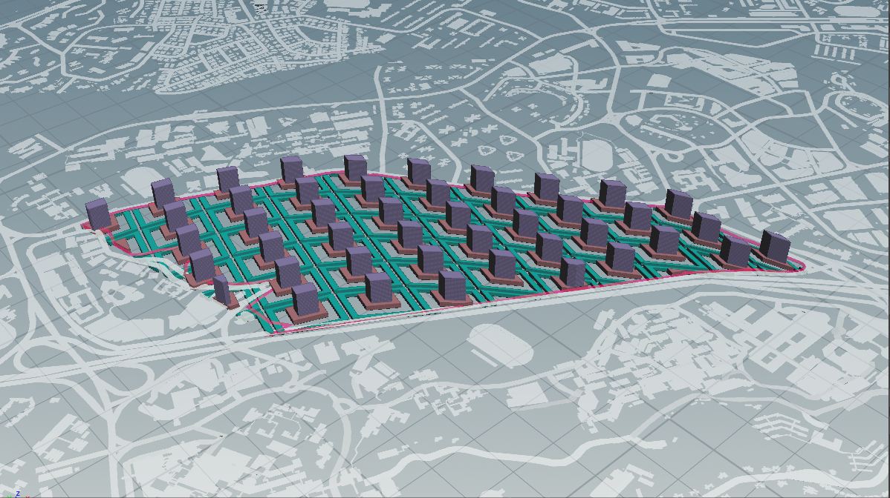
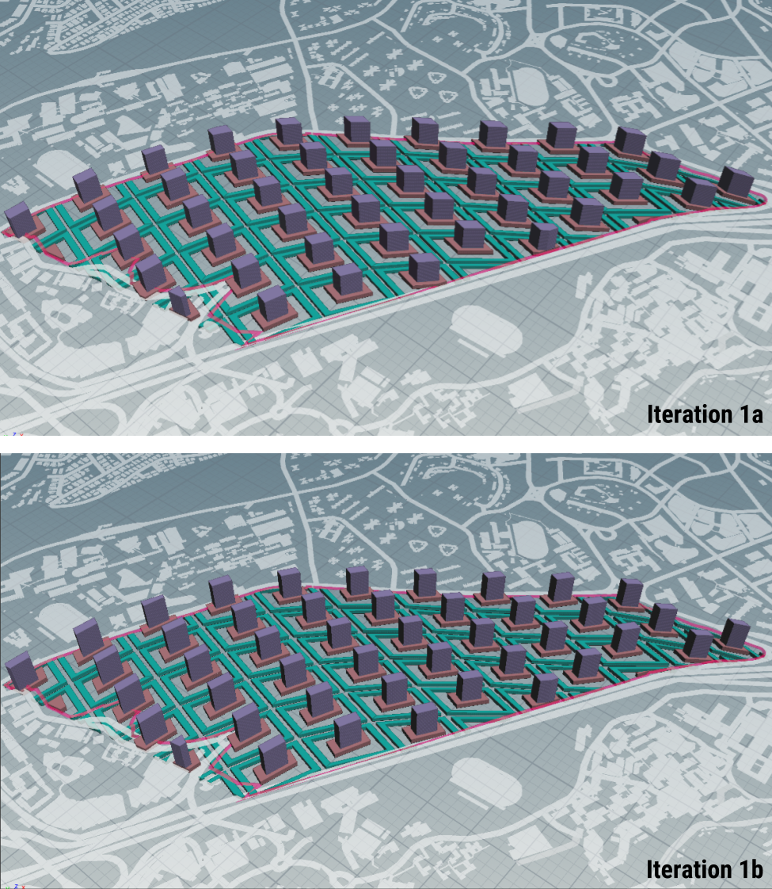
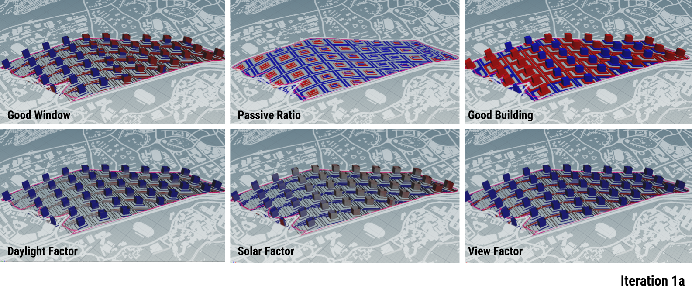
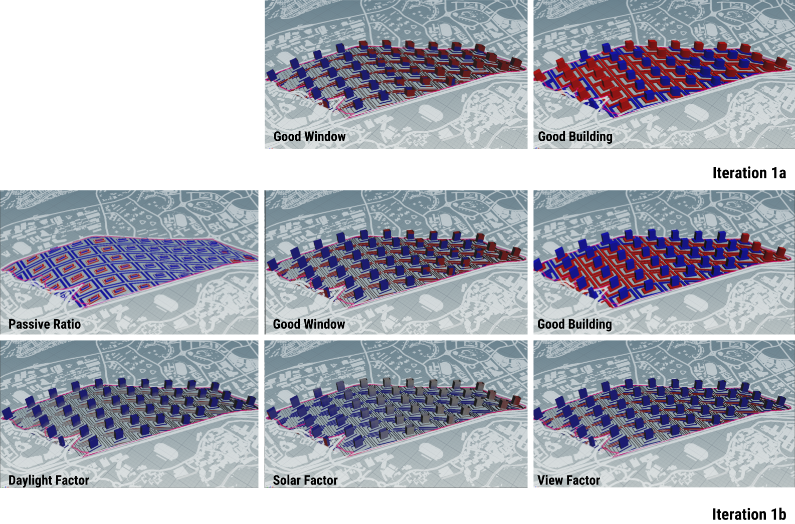

# Iteration 1 - Morphology of Urban Block

Figure 1.0 Iteration 1

For the first iteration, the different “tiers” of the urban block are generated in order to form the podium + tower typology.

 

Figure 1.1 Urban block morphology and Street canyon

### Generative Process

This is generated through the following process:

Dividing site into urban blocks > Forming plots > Specifying relative density for each required program > Make building > Evaluate building

Figure 1.2 Generative process for iteration 1

Figure 1.3 Computational process for iteration 1

### Parameters

* Residential storey height: 3m
* Commercial storey height: 5m
* Institutional storey height: 4m
* Road width: 8m

### Changes to Iteration 

* increasing the street width (thereby improving the view factor and daylight factor)
     * changed polyexpand setting: offset (inside) from 4m to 6m
* rotating building angle to better align with east-west orientation, for better daylight
     * done by editing scale of primitive of both the podium plots: x:0.6, y:0.4, z:1
     
 

Figure 1.4 Widening street width and Rotating building angle

(do note that diagrams are only a graphical representation and not accurate to scale)

 

Figure 1.5 Iteration 1a and iteration 1b

### Evaluation of Results

Figure 1.5 Iteration 1a results

Figure 1.6 Comparison of results between Iteration 1a and iteration 1b

__Tower block.__ There is a stark increase in the number of good buildings for the tower blocks, owing mainly to the improved passive area ratio. The improvement in the number of good windows (that also contributes to increase in number of good buildings) was due to the improvement in solar factor (less solar heat gain due to increased incident radiation). Both of which are a result of changing the orientation of the buildings' long axes in the east-west direction. 

There is no significant improvement in the number of good buildings for the podium and precinct blocks.

__Implication of Change__

In an attempt to improve the view factor of the precinct blocks, the street width was increased from 8m to 12m. Taking the human scale into consdieration, not all of the width should go into the increase in width of vehicular roads, but rather, should be treated as an opportunity for designing livelier streetscapes in the direction of a car-lite neighbourhood. This can be done by providing sidewalks, bike paths, urban furnitures, etc. The increase in street width can be thought of as a shared space that accommodates different user groups (pedestrians, cyclists, drivers, users of public transport) to increase urban vitality.
