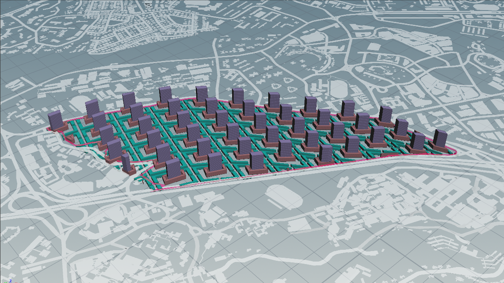
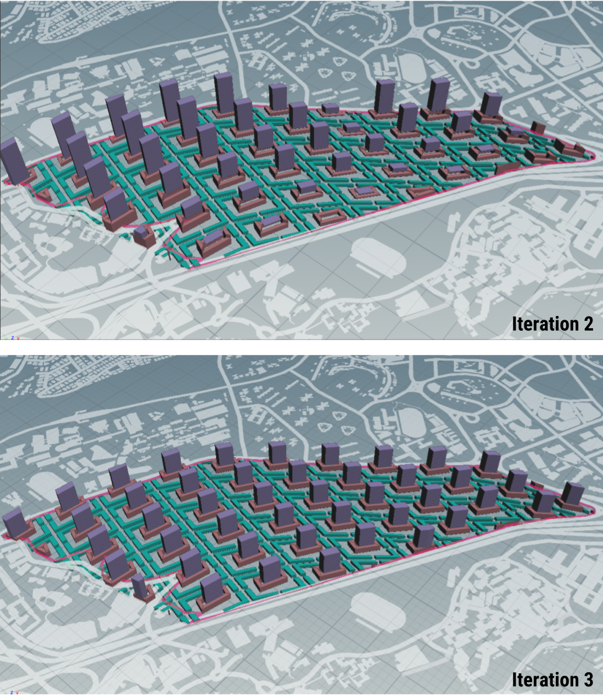

# Iteration 2 - Urban Porosity

Figure 2.0 Iteration 2

Urban permeability is achieved by bisecting the precinct blocks, allowing ease of pedestrian access, increasing connectivity.

The potential for integrating public space and community and recreation space within each urban block can be achieved by providing a sheltered area within the atrium of the podium block. In terms of building performance, this helps to increase the passive area ratio of the building. 

Figure 2.1 Community and recreation space within atrium and podium block

### Changes from iteration #01

* changes to precinct block
  * boolean polyexpanded cutting lines with original precinct plot 
* changes to podium block 
  * polyexpand offset (inwards) by 12 m to create atrium
  
  
 

Figure 2.2 Changes to precinct and podium block

### Generative Process

This is generated through the following process:

Dividing site into urban blocks > __Forming plots__ > Specifying relative density for each required program > Make building > Evaluate building

Figure 2.3 Generative process for iteration 2

Figure 2.4 Computational process for iteration 2

### Parameters

* Residential storey height: 3m
* Commercial storey height: 5m
* Institutional storey height: 4m
* Road width: 12m
* Precinct opening width: 8m
* Podium block width: 12m

 

Figure 2.5 Iteration 1b and iteration 2

### Evaluation of Results

Figure 2.6 Comparison of results between Iteration 1b and iteration 2

__Podium block__ Including an atrium in the podium block greatly improved the passive area ratio. It did not improve the number of good windows, because adding an atrium does have much effect on the daylight factor, solar factor or view factor. With the introduction of the atrium, there is an opportunity to develop new void deck typology or incorporate more social spaces.

There is no significant improvement in the number of good buildings for the precinct blocks. The morphological changes to the precinct block did not improve the building efficiency performance. However the main purpose of the change was for increased connectivity rather than to meet the evaluative standards. 
