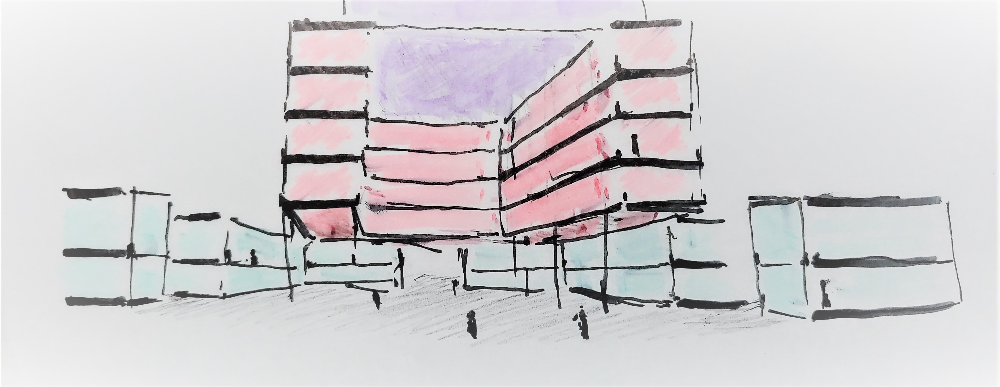
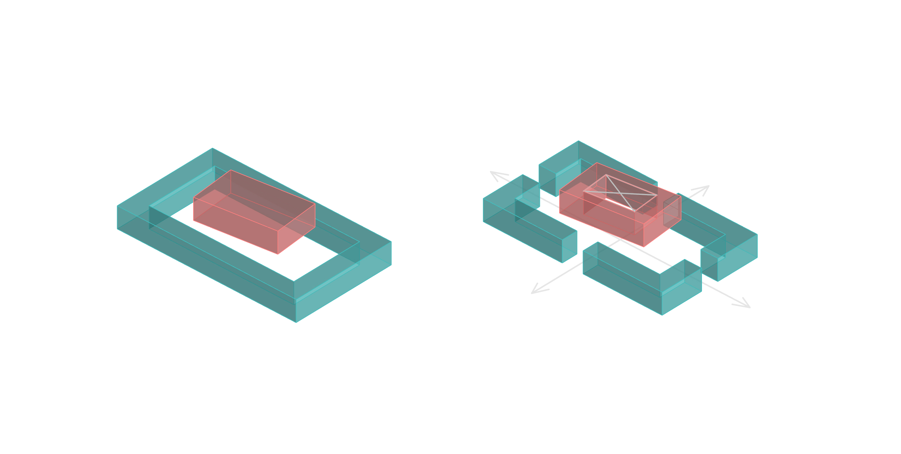
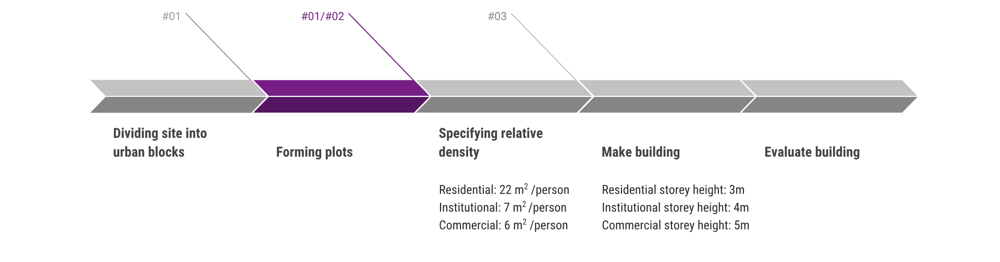
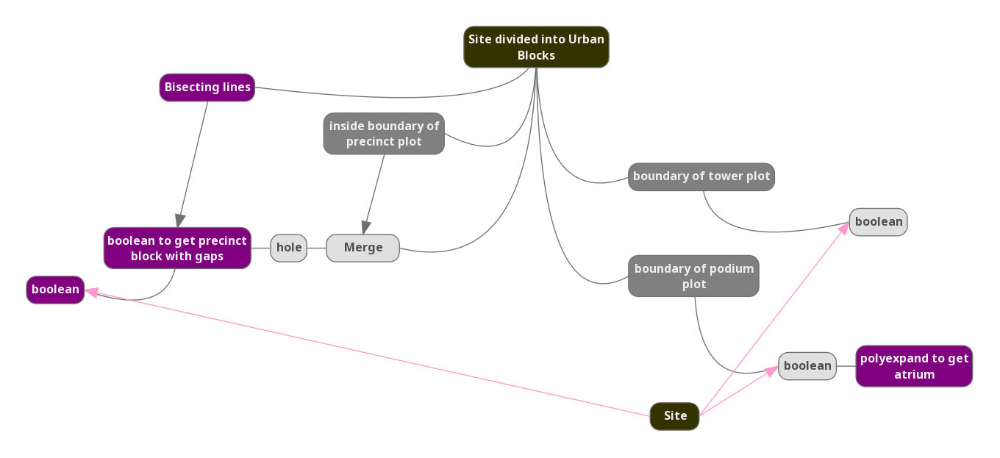

# Iteration 2 - Urban Porosity

Urban permeability is achieved by bisecting the precinct blocks, allowing ease of pedestrian access, increasing connectivity.

The potential for integrating public space and community and recreation space within each urban block can be achieved by providing a sheltered area within the atrium of the podium block. In terms of building performance, this helps to increase the passive area ratio of the building. 

Figure 2.1 Community and recreation space within atrium and podium block

### Changes from iteration #01

* changes to precinct block
  * boolean polyexpanded cutting lines with original precinct plot 
* changes to podium block 
  * polyexpand offset (inwards) by xx m to create atrium
  

### Generative Process

This is generated through the following process:

Dividing site into urban blocks > __Forming plots__ > Specifying relative density for each required program > Make building > Evaluate building

 

### Parameters

* Residential storey height: 3m
* Commercial storey height: 5m
* Institutional storey height: 4m
* Roads: xx m

### Evaluation of Results

Lorem ipsum dolor sit amet, consectetur adipiscing elit, sed do eiusmod tempor incididunt ut labore et dolore magna aliqua. Ut enim ad minim veniam, quis nostrud exercitation ullamco laboris nisi ut aliquip ex ea commodo consequat. Duis aute irure dolor in reprehenderit in voluptate velit esse cillum dolore eu fugiat nulla pariatur. Excepteur sint occaecat cupidatat non proident, sunt in culpa qui officia deserunt mollit anim id est laborum.
