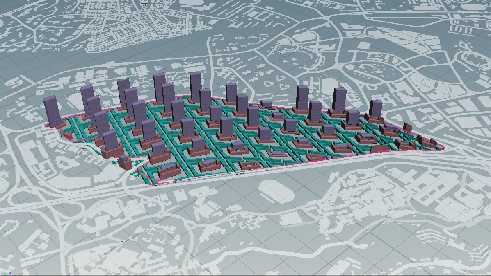
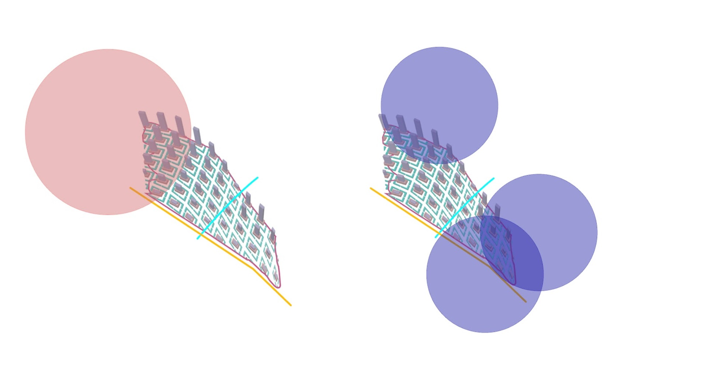
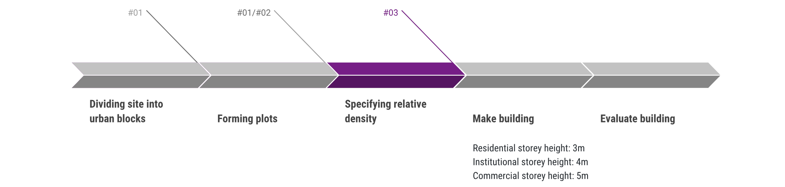
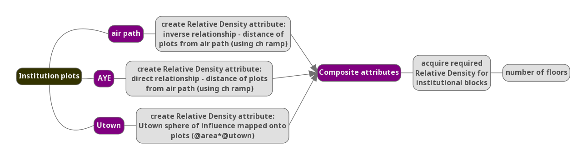
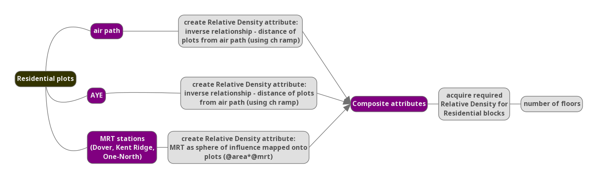
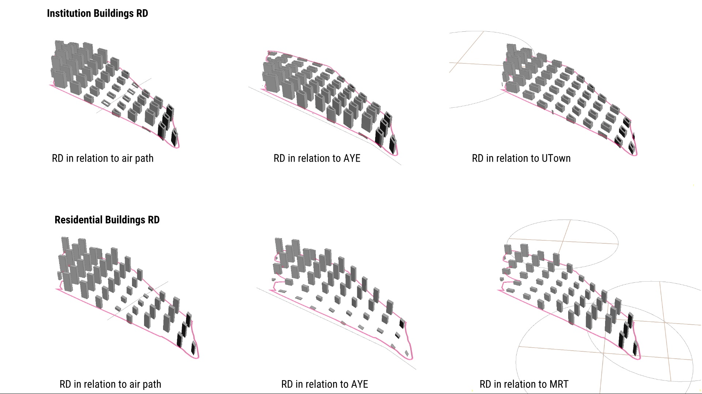
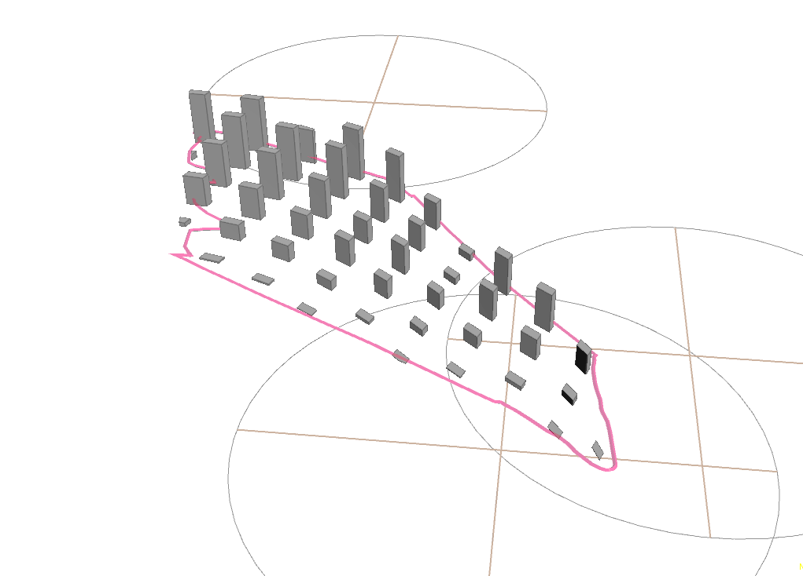
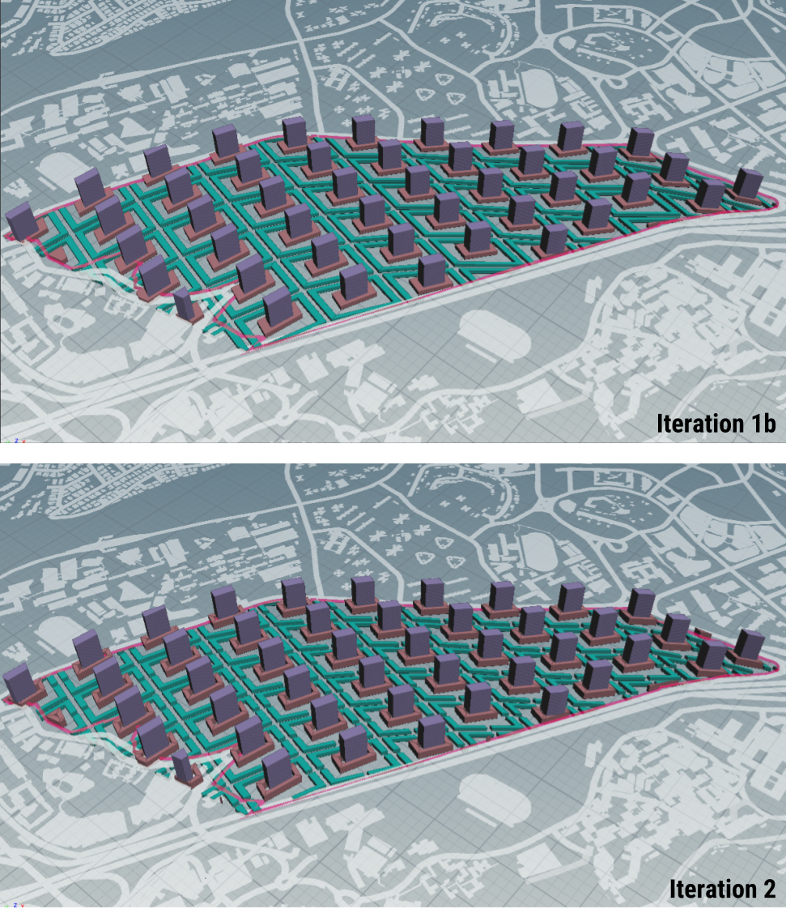
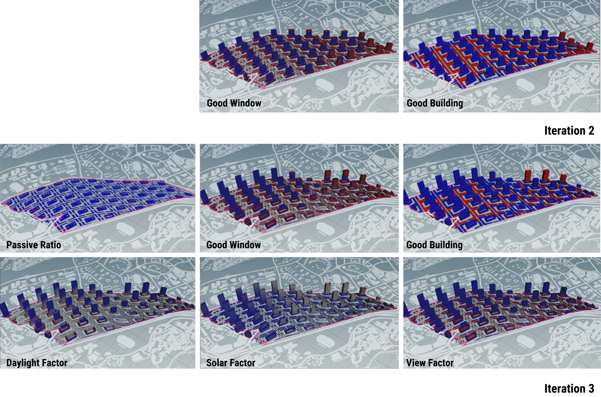

# Iteration 3 - Zoning through Parametric Attractors

Figure 3.0 Iteration 3

Various attributes are mapped in as parameter within the modelling network. 

Residential buildings (the tower blocks) are planned wtih increasing relative density (RD) in closer proximity to MRT stations to encourage the use of public transportation. They are also situated further from the AYE for the comfort of the residents (issues of traffic noise etc). Institution buildings (the podium blocks) are zoned close to Utown, facilitating ease of knonwledge exchange betweeen instituitions and offices and R&D from the convenience of proximity. They are also planned in increasing relative density along the AYE (since those buildings are more likely to be air-conditioned and closed off, where noise will be less of a concern), allowing a buffer distance between residential blocks and AYE. Commercial buildings (the precinct blocks) are present in every urban block, providing a sense of enclosure for the public space that resides within it. 

Figure 3.1 Factors affecting RD of Institutional buildings

### Changes from iteration #02

* changes to required relative density for institutional buildings
* changes to required relative density for residential buildings

### Generative Process

This is generated through the following process:

Dividing site into urban blocks > Forming plots > __Specifying relative density for each required program__ > Make building > Evaluate building

Figure 3.2 Generative process for iteration 3

Figure 3.3 Computational process for iteration 3

### Parameters

* Residential storey height: 3m
* Commercial storey height: 5m
* Institutional storey height: 4m
* Roads: xx m
* Attribute composite blending weights (Institutional Blocks)
  * air path: 0.50
  * AYE: 0.75
  * Utown: 0.60
* Attribute composite blending weights (Residential Blocks)
  * air path: 0.50
  * AYE: 0.35
  * MRT stations: 0.65
  
 

Figure 3.4 Various attributes and their individual effects on RD

 

Figure 3.5 Composited attribute effect on RD. (Left: Institutional buildings. Right: Residential buildings.)

### Evaluation of Results

 

Figure 3.6 Iteration 2 and iteration 3

Figure 3.7 Comparison between Iteration 2 and iteration 3

Performance based

human

future considerations/ critique of current
form. performance. 
