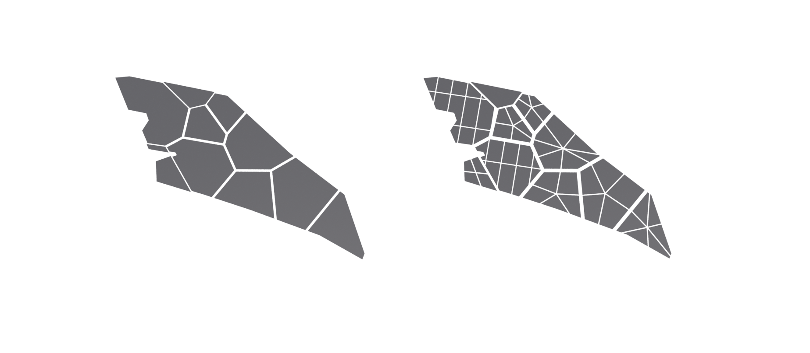

# Introduction

This chapter focuses on three primary objectives - to create non-parallel roads within districts that manifests the Dutch concept of woonerf streets, work-live mini urban plots that facilitate easy transportation between home, recreation and the office, and lastly on Singapore's idea of a Garden City where plenty of green spaces are catered for in the form of shared courtyards and setbacks.

The first two iterations will revolve around the same three road networks shown below.

**Road Network 01**

**Road Network 02**

**Road Network 03**

