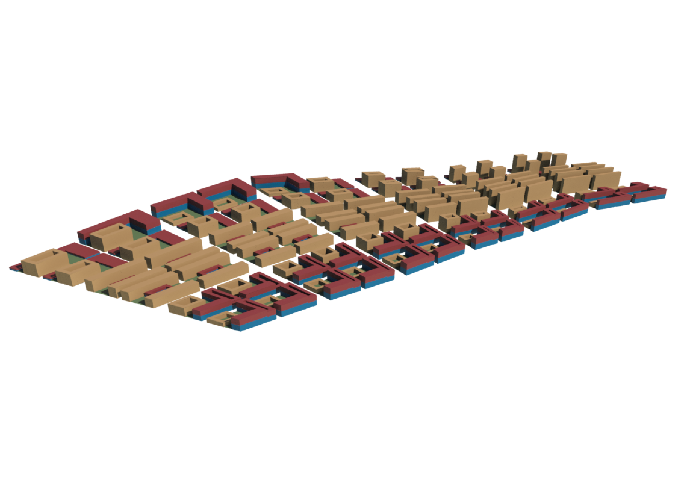
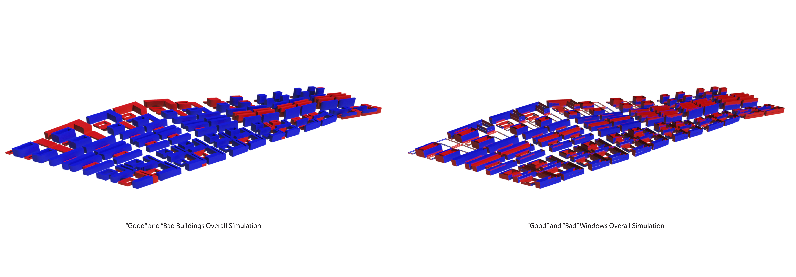
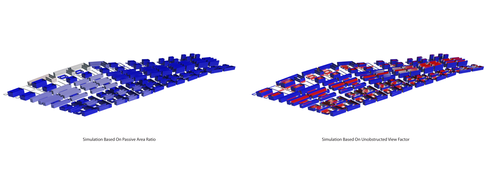
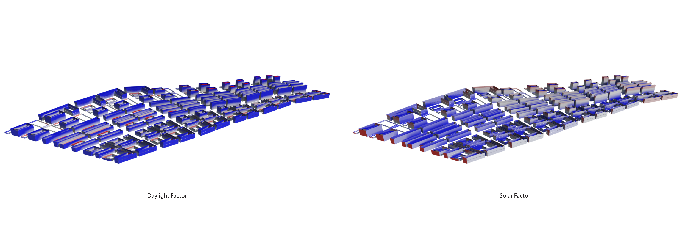
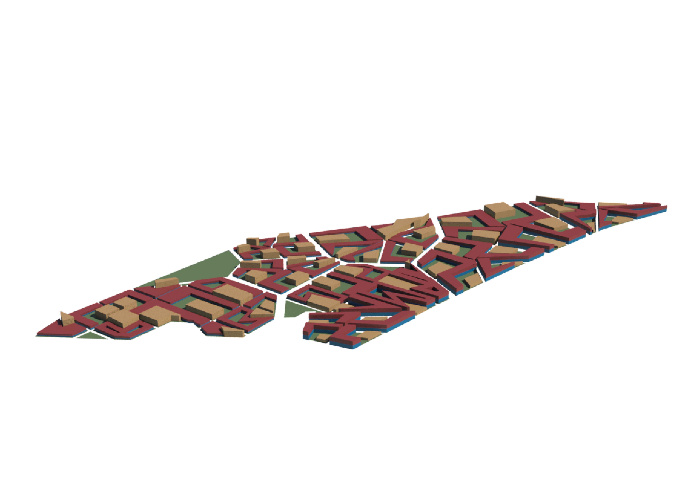
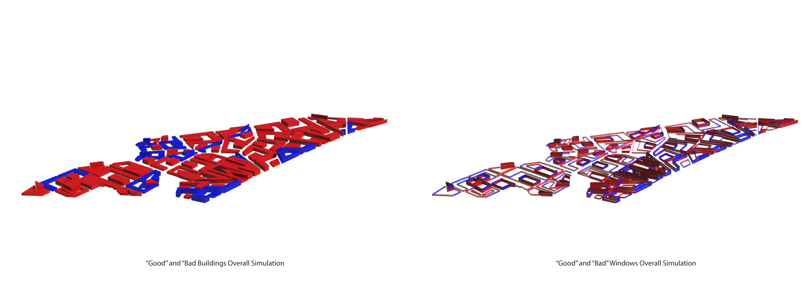
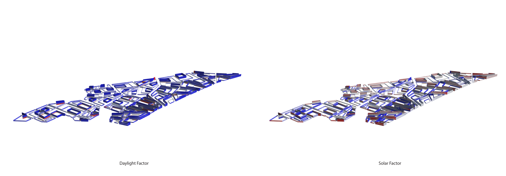
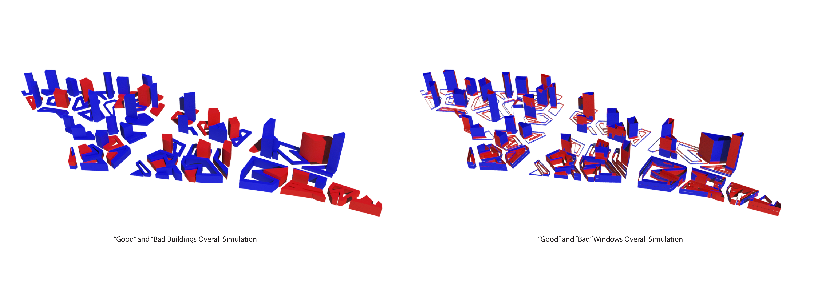
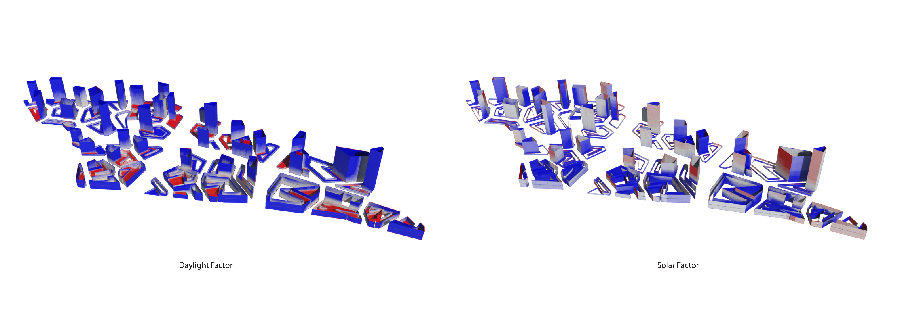

# Iteration 2

Iterations 02/A-C, similar to Iteration 1, features simulations based on one block typology situated in the three road networks described in the introduction of this chapter.

## 02 / A

Iteration 01/A features the first block typology where the upper one-third of the plot is allocated for shops on ground level, offices above it, and two smaller residential blocks 3-6m away from the commercial block with an ample amount of courtyard space in the middle of the three blocks. Situated in the control grid road network, commercial blocks will be clustered towards the AYE to act as a noise buffer for the residential blocks, which will be clustered towards the MRT nodes.

## 02 / B

## 02 / C

