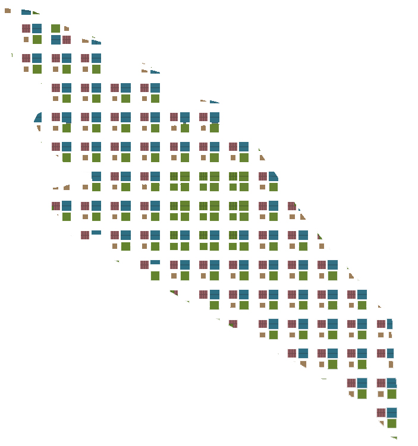

# Introduction

This chapter will be focusing on using Houdini to understand the effects of greens typology on the urban environment. This is pertaining to popular belief that the addition of greens will have some form of positive effect on the built environment. The 3 iterations will show 3 types of greens: the leftover spaces that are "green", greens on every plot and finally a central green in the middle of the development. A final iteration will be of a greater urban grid to test the widely believed positive typology of courtyard green with a central park green.

### Iteration 1: Leftover Greens 


Using a formal road grid system, the built-up area is maximized with no intention of planting greens. The greens appear in the form of leftover spaces of odd shapes and areas lesser than 150m^2. 

### Iteration 2: Greens for Everyone 


Using a formal road grid system, the built-up area is maximized with consideration in planting greens in every plot. One plot of land was specifically cut out and set aside for the local greenery. Each plot is approximately 1000m^2. 

### Iteration 3: Greens for Everyone and More  


Using a formal road grid system, the built-up area has placed consideration in planting greens in every plot as well as to set aside a central area specifically for a central park. The local greens are approximately 1000m^2.  

### Iteration 4: The Greater Grid and Green  


In an attempt to test out specifically the effect of a central park and courtyard greens, this iteration was originally one that held the hypothesis of being one that would have the highest rate of good buildings, which in turn will signify as a better urban environment. 

```
The thresholds for determining a good/bad building are: 
Good window thresholds
   View threshold > 0.4
   Daylight threshold > 0.1
   Solar threshold < 0.2
Good building thresholds
   Passive threshold > 0.5
   Good window threshold > 0.1
```

```
Urban parameters:  
Area: 75ha
Expected Population: 75,000
Area/ person: 75m^2 
```
