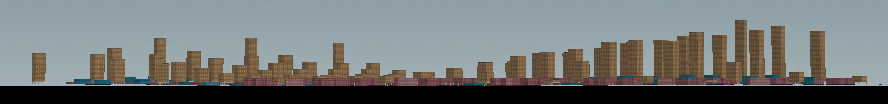
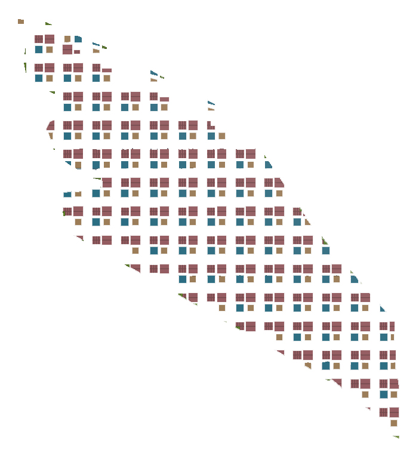
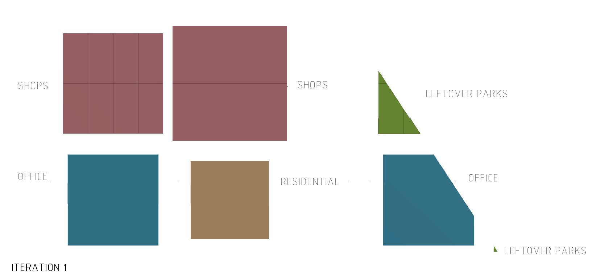

# Iteration 1: Leftover Greens


<p align="center"> 1 elevation

This first iteration is an example of a highly dense built-up environment. The height of the residential blocks are affected by the proximity to the MRT nodes. The elevation shows the skyline of the urban planning. The distribution is fairly well gradient. There were no sudden increase in building height. 

<p align="center">
<p align="center"> 2 urban plan

The greens are allocated in the periphery of the urban plot that manifest itself as leftover spaces of areas less than 150m^2. This is an enactment of when the naturalscape is not accounted for, or purposefully designed for. 

>````
>Road Width: 16m
>Total No. of Buildings: 948
>````

<p align="center"> 
<p align="center"> 3 plot allocation
   

