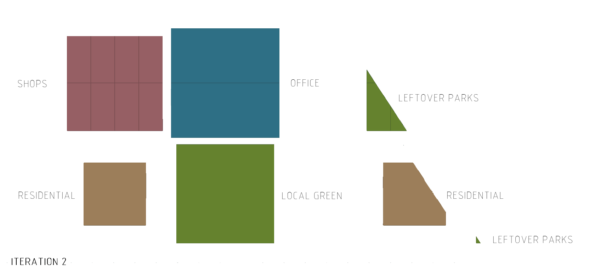
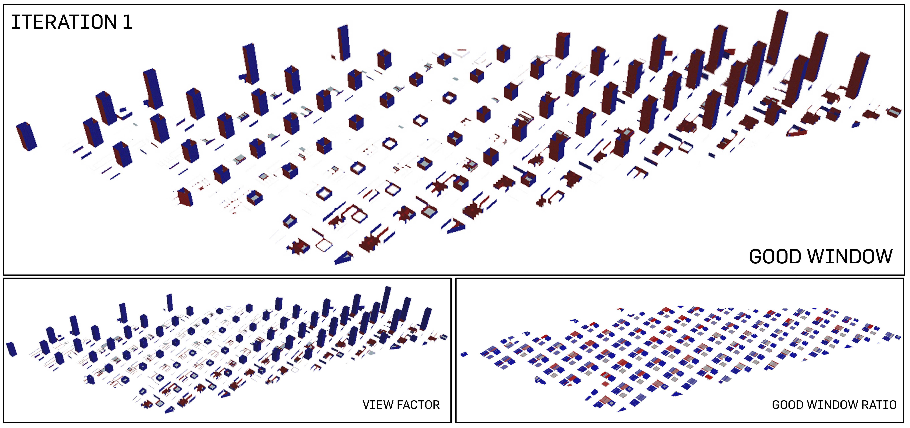
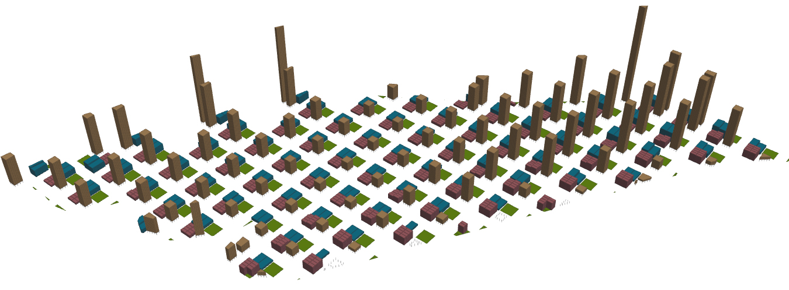

# Iteration 2: Greens for Everyone


<p align="center"> 1 elevation

The second iteration is continues the typology of a highly dense built-up environment. The height of the residential blocks are affected by the proximity to the MRT nodes. The elevation shows the skyline of the urban planning. The distribution is slightly steeper. There was 1 sudden increase in building height. This is due to the intended allocation of one of the existing plot for a localized green. 

<p align="center">
<p align="center"> 2 urban plan

The greens are allocated in one of the subplot in the urban plot that manifest itself as a localized green space to be shared by each plot's users. The area amount to about 1000m^2. 

````
Road Width: 20m
Total No. of Buildings: 801
````

<p align="center"> 
<p align="center"> 3 plot allocation
   
A total of 75m^2 is allocated to each person on site. The following is the breakdown of the allocation of plot percentage. Residential was allocated the highest percentage for improved standard of living. 
````
Commercial: 10m^2
Office: 15m^2 
Residential: 50m^2
`````
<p align="center"> 
<p align="center"> 4 analysis of good buildings

It is visible from the analysis that the majority of the good buildings are the residential blocks. This is in line with the good results from the passive ratio and daylight factor. However, in terms of the solar factor, it is exposed to high amount of solar radiation from the east-west facing windows, resulting in some "bad" readings of the buildings. 

````
Percentage of Good Buildings: 38.6% 
````

<p align="center"> 
<p align="center"> 4 analysis of good windows

The high percentage of good windows came as a surprise due to the high amount of solar radiation that high-rised buildings would be exposed to. Overall, the view factor was positive, as well as the good window ratio. 

````
Percentage of Good Windows: 83.9% 
````

> <p align="center">
>   
> ### Evaluation 
> Although this was an iteration that did not take into account of the greens, the percentage of good windows was unexpectedly good. However, whether or not this would lead to a better urban environment would require more simulations.


