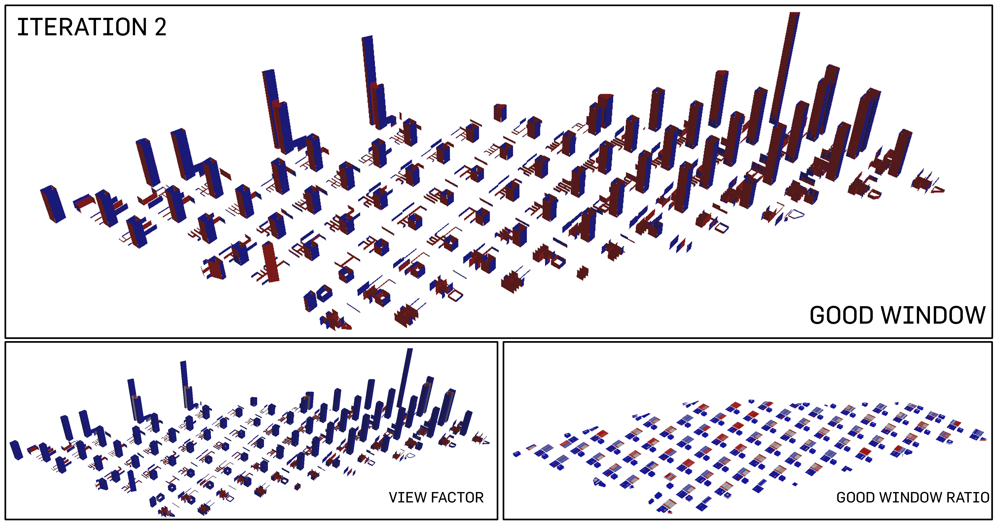

# Iteration 2: Greens for Everyone


<p align="center"> 1 elevation

The second iteration is continues the typology of a highly dense built-up environment. The height of the residential blocks are affected by the proximity to the MRT nodes. The elevation shows the skyline of the urban planning. The distribution is slightly steeper. There was 1 sudden increase in building height. This is due to the intended allocation of one of the existing plot for a localized green. 

<p align="center">
<p align="center"> 2 urban plan

The greens are allocated in one of the subplot in the urban plot that manifest itself as a localized green space to be shared by each plot's users. The area amount to about 1000m^2. 

````
Road Width: 20m
Total No. of Buildings: 801
````

<p align="center"> 
<p align="center"> 3 plot allocation
   
A total of 75m^2 is allocated to each person on site. The following is the breakdown of the allocation of plot percentage. Residential was allocated the highest percentage for improved standard of living. 
````
Commercial: 10m^2
Office: 15m^2 
Residential: 50m^2
`````
<p align="center"> 
<p align="center"> 4 analysis of good buildings

In addition to the "good" residential buildings, there is a visible amount of offices that are "good" as well. This is in reaction to the localized greens on each plot that allows for greater passive ratio. That being said, the solar factor has also visibly increased due to the exposure to solar element in "empty" green plots. It has always been a balance in terms of allowing for dayighting and passivity in contrast to the solar radiation that each building will be exposed to. Overall, the percentage of "good" buildings has increased to 50.4% in comparison to iteration 1.  

````
Percentage of Good Buildings: 50.4% 
````

<p align="center"> 
<p align="center"> 4 analysis of good windows

Unexpectedly, as what we observe from iteration 1, the high percentage of "good" windows has still maintained although statistically, it has decreased by 1%. The   

````
Percentage of Good Windows: 82.6% 
````

> <p align="center">
>   
> ### Evaluation 
> Although this was an iteration that did not take into account of the greens, the percentage of good windows was unexpectedly good. However, whether or not this would lead to a better urban environment would require more simulations.


