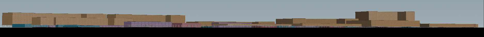
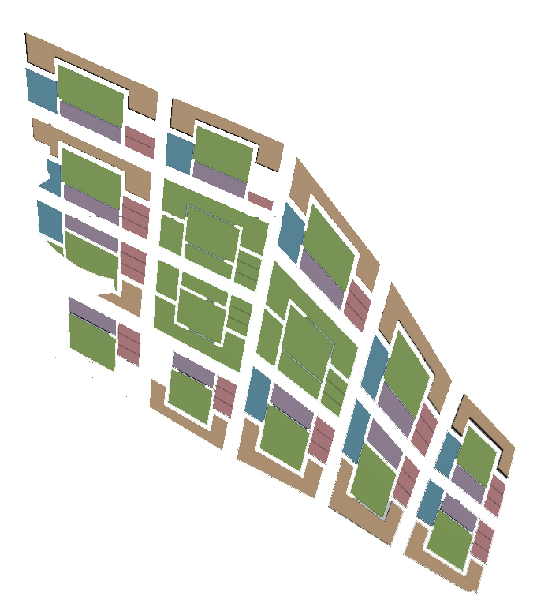
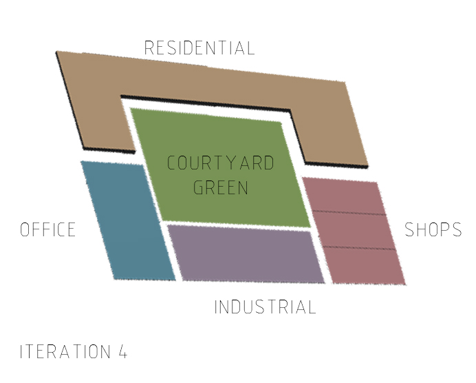
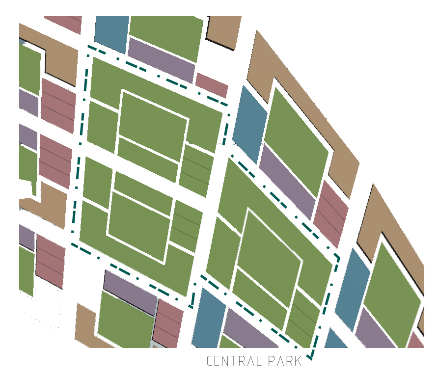
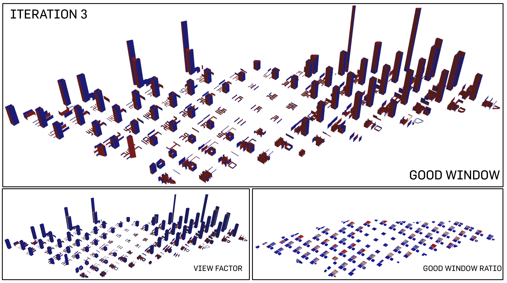
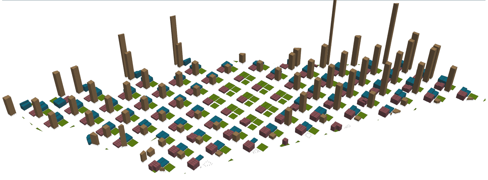

# Iteration 4: The Greater Grid and Green


<p align="center"> 1 elevation

This iteration is different from the first 3 as this deals with a different grid, such that further emphasis can be placed on extreme greenery such as a combination of courtyards and a larger central park. 

<p align="center">
<p align="center"> 2 urban plan

The greens are allocated in 2 ways: one of the subplot in the urban plot that manifest itself as a 1000m^2 localized green space to be shared by each plot's users and the other in the form of a central park.  

````
Road Width: 20m
Total No. of Buildings: 774
````

<p align="center">  
<p align="center"> 3 plot allocation
   
A total of 75m^2 is allocated to each person on site. The following is the breakdown of the allocation of plot percentage. Residential was allocated the highest percentage for improved standard of living. 
````
Commercial: 10m^2
Office: 15m^2 
Residential: 50m^2
`````
<p align="center"> 
<p align="center"> 4 analysis of good buildings

One thing noticeable is the constant reading of "good" building for the residential blocks, even as they start to go oddly disproportionate in terms of scale. Commerical facing the central park has changed its reading to "good" as well; this may raise further hypothesis of the benefits of multiple satellite greens on one urban (instead of iteration 3 where there is only 1 central park) that may benefit the buildings. The passive ratio has been increasing while solar factor, as always, suffers as the daylight factor and passive ratio increases.    

````
Percentage of Good Buildings: 52.2% 
````

<p align="center"> 
<p align="center"> 4 analysis of good windows

The readings for good windows has been contradicatory. The percentage showcases a high of 83.2% when the simulation has described multiples of "bad" windows. In stark contrast, the view factor and good window ratio has visibly improved.   

````
Percentage of Good Windows: 83.2% 
````

> <p align="center">
>   
> ### Evaluation 
> This iteration further demonstrated the connection between green spaces and the certain increases in certain factors such as daylight factor, view factor and passive ratio. However, the connection that drives the disappointing results of the good window, solar factor and good building is also one to note specifically. 


