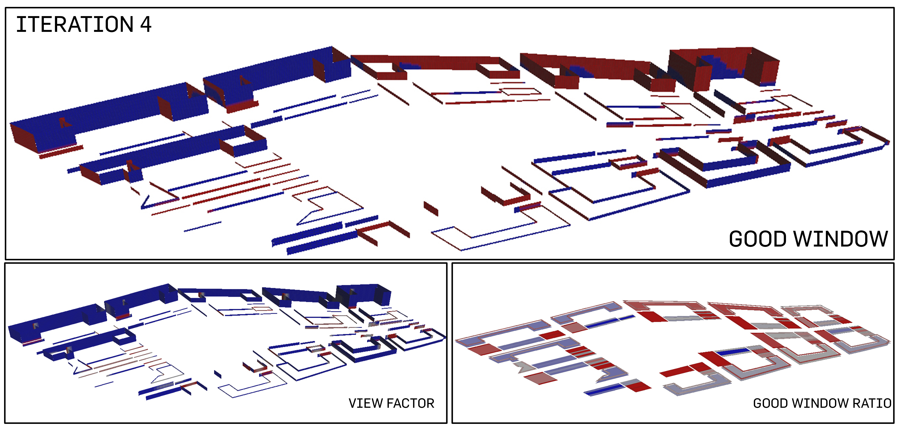
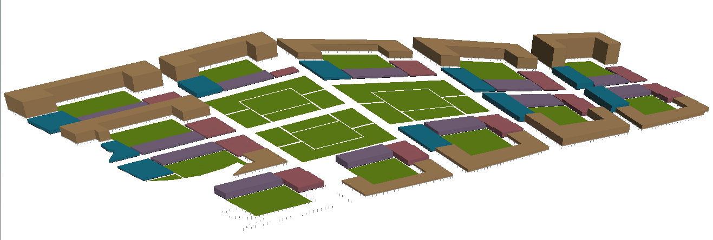

# Iteration 4: The Greater Grid and Green


<p align="center"> 1 elevation

This iteration is different from the first 3 iterations as this deals with a different grid, such that further emphasis can be placed on extreme greenery such as a combination of courtyards and a larger central park. The built-up density is very much different; the elevation is much more squat and the building blocks are greater in size. While the 3 iterations are packed vertically, this iteration packs the population and programmes lower in the ground in massive blocks.  

<p align="center">
<p align="center"> 2 urban plan

The greens are allocated in 2 ways: one of the subplot in the urban plot that manifest itself as a courtyard space and the other in the form of a central park that takes up roughly 3 urban plots. 

````
Road Width: 20m
Total No. of Buildings: 66
````

<p align="center">  
<p align="center"> 3 plot allocation
   
A total of 75m^2 is allocated to each person on site. The following is the breakdown of the allocation of plot percentage. Residential was allocated the highest percentage for improved standard of living. This iteration has included industrial into the formula, hoping that the large presence of green spaces could form green buffers and build up enough breathing spaces to mitigate the industrial buildings that are injected into the site. There are many more different methods that this could be maneuvered which gives more room for simulations and hypothesis. 
````
Commercial: 10m^2
Office: 15m^2 
Industrial: 10m^2
Residential: 40m^2
`````
<p align="center"> 
<p align="center"> 4 analysis of good buildings

It was surprising to note that this model of huge urban grid does not sit well with courtyard greens and central park. The percentage of "good buildings" hit a low of 10.6%. Probably the saving grace of such a typology is the amount of daylight that is entering into the building. This probably would be a better typology for a temperate climate instead of a tropical country like Singapore. That being said, the urban trend in Singapore is going towards a smaller urban grid of smaller perimeter, instead of the traditional townhouse or courtyard typology that European countries prefer.    

````
Percentage of Good Buildings: 10.6% 
````

<p align="center"> 
<p align="center"> 4 analysis of good windows

Similar to the daylight factor in the analysis of the "good buildings", the view factor of the "good windows" were the aspect that was positive amidst simulation of how unsatisfactory the windows were. It is interesting to note that not only tall skyscrapers are able to achieve positive results for view factor; the input of courtyard greens and central parks has allowed for the low-rise bulky buildings to also enjoy the benefits of vistas.    

````
Percentage of Good Windows: 49.8% 
````

> <p align="center">
>   
> ### Evaluation 
> This iteration has only kickstarted more variations and more possibilities in terms of how Houdini could help to simulate the synthesis between green spaces and buildings.  


