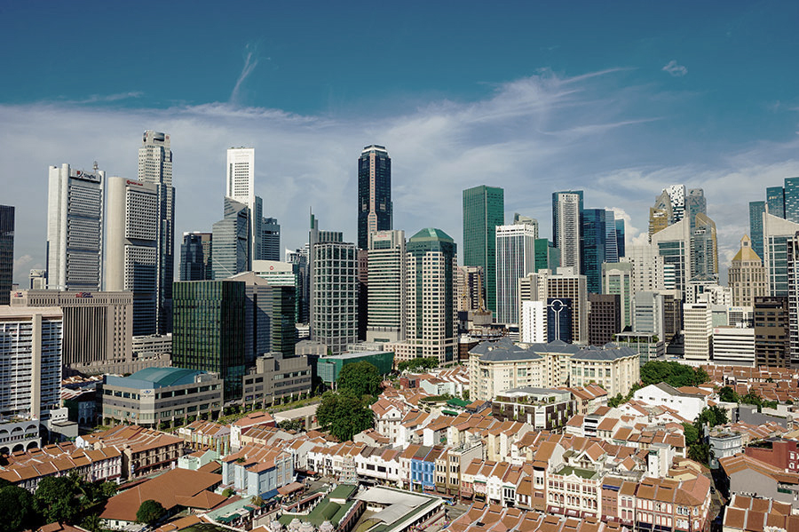

# Introduction

Source from Google

## Concept

This project aims to explore the overall evaluation of urban areas constructed by two kind of urban fabrics under the influence of traffic leading factors, so as to obtain the optimal daylight, view and solar while improving the residential density as much as possible. The applicable situation is that when modern high-rise residential areas and traditional flat commercial residential areas meet in urban planning, attention would be paid to how to optimize the road network, building form, program mix, so as to achieve the optimal economic and technical indicators in residential areas and maximize the interests of developers.The overall train of thought can be divided into road network construction, program mix, buildings generation, and final simulation. If look from the top down, in order to build an urban cluster, we first need to disassemble the entire urban blueprint into corresponding blocks, and then map the corresponding blocks to different urban clusters. 

## Layout

In terms of the overall layout, the plan mainly divides the site into two major zones, which respectively adopt enclosed-type and point-type buildings. A commercial residential area with a point tower and podium building along the Dover side from northwest to southeast; Along aye, a cluster of open green Spaces in the center, surrounded by shops, residential buildings, office buildings and factories. The main road network is fishbone, with an urban artery road between the two sections, extending from the northwest to the southeast. Then the urban branch road is extended from the main road, and the roads in the zones are controlled by urban grid in two different scale respectively. The building height overall presents the characteristics of high north and low south. The height of residential buildings in the northern region 1 is affected by the distance from the three MRT subway stations. The closer it is to MRT, the higher population density is. Commercial podium buildings are affected by the distance from aye. The closer the city express road is, and the more the commercial quantity is distributed. Zone 2 is planned according to functions, mainly for commercial and residential, supplemented by a small number of offices and industries. Different from the large-scale building volume and open space of sunshine in the new urban area similar to Zone 1, Zone 2 is more like the the old residential area, with small and dense building volume and narrow space. 

## Analysis Parameters

The thresholds for determining a good/bad window and building are as follows:

Good Window threshold:

View threshold > 0.4
Daylight threshold > 0.1
Solar threshold < 0.2
Good Building thresholds:

Passive threshold > 0.5
Good window > 0.1
