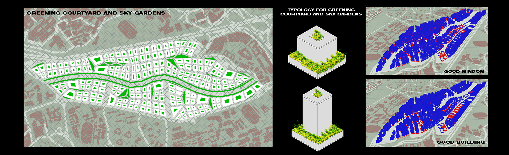
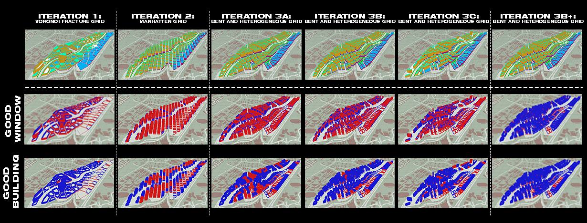

# Discussion

In all, I have learnt that both plot size, the choice of urban grid and also building typology are important consideration to design a successful urban masterplan. 
The apportionment of plot and the setting out of road networks was essential in determining the result of an efficient and sustainable urbanscape, as the way the plot is subdivided determines how the plot relates to its surrounding context.
In terms of determining distances between building, larger the spacing between buildings, the more the amount of daylight entering the building. However, the amount of daylight entering the building comes with solar heat gain, which we do not want in a tropical climate. While we find an optimal distance between buildings to have acceptable solar gain with ideal daylighting, we need to consider views from the building as they might be compromised in the process.
The density of this urban morphology is dependent on the population density apportioned by using attractor (MRTs) and repeller (AYE) points in the site context. 

Figure 14. Iteration 3b+. Opportunities for courtyard greening, improvement upon Iteration 3B

As observed, the best plot distribution option is Iteration 3, where the road network integrates to its existing adjacent roads networks. Option 3B achieves the best results with 83.68% Good building and 25.35% Good windows (without considering courtyard greenery and landscape as “desirable” views). In terms of building typology, the courtyard tower option, 3A and 3B is observed to have opportunities to attain high view-factor if we consider greenery and landscaping in the courtyard as a “desirable” view. Option 3C has missed opportunities without a courtyard, but it is an economical and popular choice for developers.

Figure 15. Overview of Iterations and simulation results

Through rounds of building simulations using quantifiable factors, parameters and specifications, we were able to determine the efficiency of each urban design option and find an optimal way of designing the plot. To further improve on the urban form, atrium through the courtyards of the residential tower into the commercial podium can be considered. This would improve the currently low daylight factor of the commercial areas.
Aside from the performance analysis done in this research, Other areas of urban design to be considered are wind flow through the site, usability of public spaces and shading of pedestrianized walkways.
