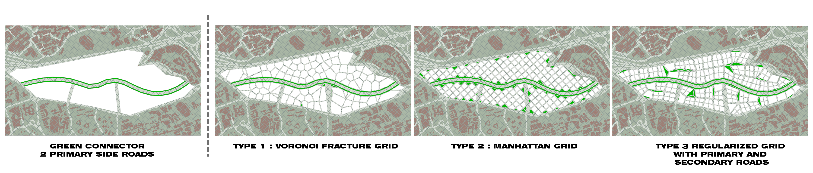

# 2 Introduction

This chapter seeks to explore the site context of the one-north district, finding main connections to integrate current roads and identifying important attractor and repeller points in the vicinity that would affect the planning of the urban scape. Also, three different urban grids will be explored in distributing the plot.

 

## 2.1.	Main connections
The plot of the project site between AYE and Dover road. We are interested to plan this plot as a mixed-used commercial and residential development. Circulation into and within the site was an important first step. The main access to this plot is through Dover road. Continuing from Dover rise and Dover avenue, we extend the roads into our site. Across the plot, we planned for a green connector from college avenue to the end of dover road, connecting the NUS campus to the one-north R&D and High-tech cluster.

## 2.2.	Nodes affecting the distribution of buildings (defining relative densities)
For the following iterations and simulations, a different set of criteria will be used to determine the density of residential and commercial developments to be planned within the plot. The main criteria that determines this density is its proximity to MRT stations in which it will have a positive relationship, and its proximity to AYE in which it will have a negative relationship with. 

From the plotted mapping, its determined relative density is visualised with a colour density map shown in Figure 3. The redder/warmer spots show higher density of population while the bluer/cooler spots show lower population and hence lower density of developments.

## 2.3.	Plot Distribution

Various organisational methods and road widths were considered when dividing the plot. We came out with 3 types of grid distribution and gave them an evaluation in terms of its density, road organisation, avaliability of green spaces and its implications on view and facings. This is to understand the benefits of each apportionment method and bring its lessons forward to a scheme that is “bent and heterogeneous”.

## 2.4.	Standards for simulations

Subsequent simulations will be based on the following standards

For good windows, 
* view_threshold>0.4 
* daylight_threshold>0.1 
* solar_threshold<0.2 

For good building thresholds, 
* passive_threshold>0.5 
* good_window_threshold>0.1

# Introduction 3
## 3.1
1. one
2. teo
3. qwe

hello:
>
