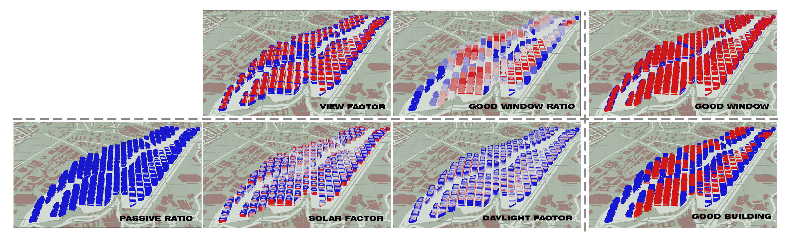

# 4. Iteration 2: Manhattan grid

This iteration features simulation based on the same block typology tested on Type 2 Manhattan grid as described in the introduction of the chapter. Iteration 2 features the same typology where the residential tower sits on the commercial podium block.

Figure 8. Block typology and Urban morphology for Iteration 2

## 4.1.	 Set-up 
### 4.1.1.	The distribution of residential and commercial area is as follows
* Residential: 22sqm per person
* Commercial: 13sqm per person 
### 4.1.2.	Parameters for urban morphology
vResidential storey height: 3m
* Commercial storey height: 5m
* Green connector road 15m 
* Green buffer 5m (each side)
* Roads 8m
* Pedestrian roads 1.5m
* Parks < 1000sqm
### 4.1.3.	Urban morphology
* Maximum floor count: 18
* Average floor count: 7
* Total number of buildings: 162

## 4.2.	Building Simulation 

Figure 9. Iteration 2 Building simulations

### 4.2.1.	Good Building = 45.47%
* Daylight factor = 27.07%
* Passive ratio = 100%
* Solar Factor = 87.18% 

### 4.2.2.	Good Window =13.48%
* View Factor = 23.14%
* Good window ratio = 45.47%

## 4.3.	Evaluation
Even though the division of plot, with quadrilateral blocks, has improved from Iteration 1, the number of bad buildings in this iteration has increased. This is due to increased number of bad windows. Due to the Manhattan grid, the density of buildings has increased. This has resulted in an increased number of poorer windows with obstructed view. While the urban morphology has improved, the efficiency and quality of the built environment has become worse.
In the next iteration, the plot will be improved by defining primary roads (wider) and secondary roads so as to allow for more space between adjacent buildings. More space for parks will also be allocated to break up the regularity of the Manhattan grid and provide more opportunities to improve its view factor.
