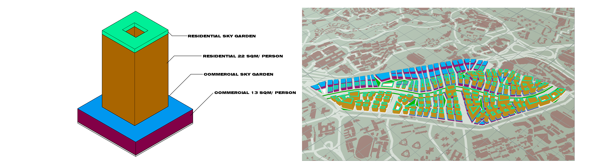

# 5. Iteration 3 Regularized Grid with Primary and Secondary Roads (Bent and Heterogeneous)

## 5.1.	Iteration A
This iteration features simulation based on the same block typology tested on Type 3 Regularized grid with primary and secondary roads, as described in the introduction of the chapter. Iteration 3A features the same typology where the residential tower sits on the commercial podium block.

Figure 10. Block typology and Urban morphology for Iteration 3a

## 5.2.	Set-up
### 5.2.1.	The distribution of residential and commercial area is as follows
* Residential: 22sqm per person
* Commercial: 13sqm per person 
### 5.2.2.	Parameters for urban morphology
* Residential storey height: 3m
* Commercial storey height: 5m
* Green connector road 15m
* Green buffer 5m (each side)
* Primary roads 8m
* Secondary roads
* Pedestrian roads 1.5m
* Parks < 500sqm
### 5.2.3.	Urban morphology
* Maximum floor count: 20
* Average floor count: 7
* Total number of buildings: 166

## 5.3.	Building Simulation

Figure 11. Iteration 3a Building simulations

### 5.3.1.	Good Building = 63.23%
* Daylight factor = 43.54%
* Passive ratio = 98.86%
* Solar Factor = 88.99% 

### 5.3.2.	Good Window =19.74%
* View Factor = 37.76%
* Good window ratio = 63.83%

## 5.4.	Evaluation
Comparing with Iteration 2, the current iteration resulted in significantly more good buildings. Solar factor, good window and view factor have improved over the formal iteration. However, as seen from the good window and view factor simulations, a significant number of buildings are still not ideal.
To improve upon the current iteration, the depth and width of the residential block is reduced, such that the towers can gain better view factor from its gain in height.

## 5.5.	Iteration B
This iteration features simulation based on the same block typology tested on Type 3 Regularized grid with primary and secondary roads, as described in the introduction of the chapter. Iteration 3B features the same typology where the residential tower sits on the commercial podium block, however, the depth and width of the residential block is reduced.

Figure 12. Block typology and Urban morphology for Iteration 3b

## 5.6.	Set-up
### 5.6.1.	The distribution of residential and commercial area is as follows
* Residential: 22sqm per person
* Commercial: 13sqm per person 
### 5.6.2.	Parameters for urban morphology
* Residential storey height: 3m
* Commercial storey height: 5m
* Green connector road 15m
* Green buffer 5m (each side)
* Primary roads 8m
* Secondary roads
* Pedestrian roads 1.5m
* Parks < 500sqm
### 5.6.3.	Urban morphology
* Maximum floor count: 22
* Average floor count: 8
* Total number of buildings: 170

## 5.7.	Building Simulation

Figure 13. Iteration 3b Building simulations

### 5.7.1.	Good Building = 83.68%
* Daylight factor = 45.66%
* Passive ratio = 98.90%
* Solar Factor = 88.52% 

### 5.7.2.	Good Window =25.35%
* View Factor = 48.46%
* Good window ratio = 84.26%

## 5.8.	Evaluation
With reduced width and depth of residential towers, view factor and good window improved significantly. Good window has increased to 25.35% from its previous 19.74%. Good building has also increased to 83.68%, up from its previous 63.23%.

The low perentage of good window here is still low at 25.35%. However, this is due to the block typology of a courtyard residential tower. All inner courtyard facing windows are considered to be unpleasant in this simulation. In reality, inner facing windows are to be considered desirable as the courtyard was meant be filled with greenery and landscape. Hence, the number of good window would be significantly higher.

## 5.9.	Iteration C
In this iteration, a standard tower typology is explored to investigate its efficiency, should developers be interested to build a tower without a central courtyard.

Figure 14. Block typology and Urban morphology for Iteration 3c

## 5.10.	Set-up
### 5.10.1.	The distribution of residential and commercial area is as follows
* Residential: 22sqm per person
* Commercial: 13sqm per person 
### 5.10.2.	Parameters for urban morphology
* Residential storey height: 3m
* Commercial storey height: 5m
* Green connector road 15m
* Green buffer 5m (each side)
* Primary roads 8m
* Secondary roads
* Pedestrian roads 1.5m
* Parks < 500sqm
### 5.10.3.	Urban morphology
* Maximum floor count: 31
* Average floor count: 7
* Total number of buildings: 170

## 5.11.	Building Simulation

Figure 13. Iteration 3c Building simulations

### 5.11.1.	Good Building = 76.69%
* Daylight factor = 62.18%
* Passive ratio = 98.36%
* Solar Factor = 82.18% 

### 5.11.2.	Good Window =36.95%
* View Factor = 62.82%
* Good window ratio = 77.64%

## 5.12.	Evaluation
Comparing Iteration 3C with Iteration 3B, Good buildings have became worse, with 76.69% of good buildings, down from its previous 83.68%. While Good Window seems to have increased to 36.95%, in reality, this option is worse-off due to the misapportunity for the tower blocks to contain courtyard gardens which would significantly increase its good window ratio.

