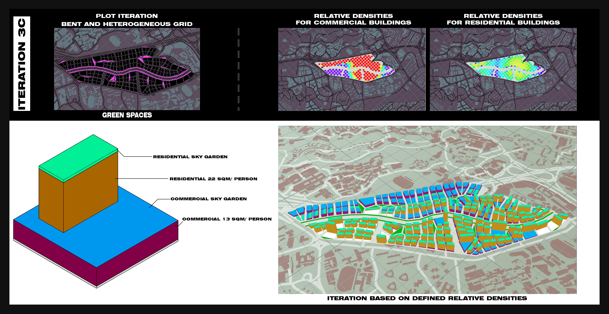

# Iteration 3 Regularized Grid with Primary and Secondary Roads (Bent and Heterogeneous)

## Iteration C
In this iteration, a standard tower typology is explored to investigate its efficiency, should developers be interested to build a tower without a central courtyard.

Figure 14. Block typology and Urban morphology for Iteration 3c

### Set-up

#### The distribution of residential and commercial area is as follows
* Residential: 22sqm per person
* Commercial: 13sqm per person 
#### Parameters for urban morphology
* Residential storey height: 3m
* Commercial storey height: 5m
* Green connector road 15m
* Green buffer 5m (each side)
* Primary roads 8m
* Secondary roads
* Pedestrian roads 1.5m
* Parks < 500sqm
#### Urban morphology
* Maximum floor count: 31
* Average floor count: 7
* Total number of buildings: 170

### Building Simulation

Figure 13. Iteration 3c Building simulations

#### Good Building = 76.69%
* Daylight factor = 62.18%
* Passive ratio = 98.36%
* Solar Factor = 82.18% 

#### Good Window =36.95%
* View Factor = 62.82%
* Good window ratio = 77.64%

### Evaluation
Comparing Iteration 3C with Iteration 3B, Good buildings have became worse, with 76.69% of good buildings, down from its previous 83.68%. While Good Window seems to have increased to 36.95%, in reality, this option is worse-off due to the misapportunity for the tower blocks to contain courtyard gardens which would significantly increase its good window ratio.
